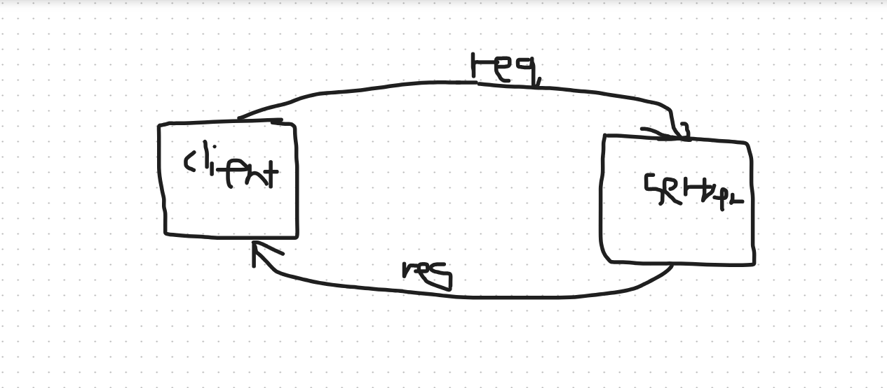

# Movies-Library
# Project Name - Project Version

**Author Name**: Muhammad Ibraheem Flaifel

## WRRC
Add an image of your WRRC here

## Overview

## Getting Started
<!-- What are the steps that a user must take in order to build this app on their own machine and get it running? -->
1.Install Node.js and npm
2.Clone this repository to your local machine
3.Initialize your project  "npm init -y"
4.Install Express.js "npm install express cors"

## Project Features
<!-- What are the features included in you app -->
retrieves movie data from a JSON file
When accessing the main route ("/"), the server responds with the movie data retrieved from the JSON file.
Accessing the "/favorite" route returns a simple message
Error Handling